# NEAR: The NetEase AR Oriented Visual Inertial Dataset

## Abstract

The existing datasets for evaluating Visual Inertial Odometry (VIO) have boosted the research of autonomous agents, but they don’t meet the prosperous research of Augmented Reality (AR) or Mixed Reality (MR) given that they are not collected at real AR scenes and do not account for affecting factors of mobile devices. This paper presents the NEAR dataset, an AR oriented visual-inertial dataset collected with commodity handheld phones with ground truth. The dataset has a total of 110 sequences in 49 elaborately designed collection cases at two typical indoor scenes, i.e. the living area and the table area. It also covers plenty of setting adjustments for comparison, including the comparisons of different level textures, illuminations, motion patterns, camera settings and the difference between the rolling shutter and the global shutter. The full dataset along with the calibration data has been publicly available [here](http://beidou.s.cn.vc/Supplier).

## Download dataset

NEAR dataset has been publicly available [here](http://beidou.s.cn.vc/Supplier).

## Case design

[CaseTableEva.xlsx](CaseTableEva.xlsx) presents all the cases designed on our dataset.

| case | environment | scene | lighting  | motion pattern                  | special device setting | devices and link  | preview |
| ---- | ----------- | ----------- | ------------ | ---------- | ------------- | ------------ | -------------------------------- |
| 1    | Easy\[1\]   | Rich\-textured desktop                   | uniform & stable      | circle \(slow\+normal\)             | default                | [iPhone 7, Huawei P20](https://beidou-sh.oss-cn-shanghai.aliyuncs.com/near_dataset/001.zip)  | 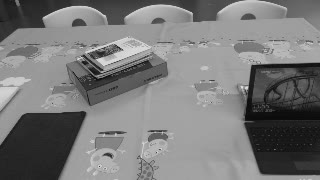 |
| 2    | Easy        | Rich\-textured desktop                   | uniform & stable      | hybrid                              | default                | [iPhone 7, Huawei P20](https://beidou-sh.oss-cn-shanghai.aliyuncs.com/near_dataset/002.zip)  | 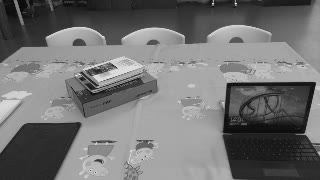|
| 2_control[4] | Easy        | Rich\-textured desktop                   | uniform & stable      | hybrid                              | default                | [iPhone 7, Huawei P20, MYNT](https://beidou-sh.oss-cn-shanghai.aliyuncs.com/near_dataset/002_control.zip) | 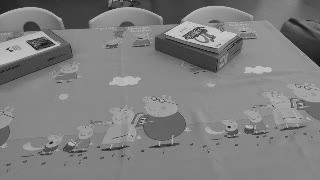|
| 3    | Easy        | Rich\-textured desktop                   | uniform & stable      | circle \(alwayse points to center\) | default                | [iPhone 7, Huawei P20](https://beidou-sh.oss-cn-shanghai.aliyuncs.com/near_dataset/003.zip)  | 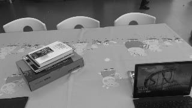 |
| 3_control    | Easy        | Rich\-textured desktop                   | uniform & stable      | circle \(alwayse points to center\) | default                | [iPhone 7, Huawei P20, MYNT](https://beidou-sh.oss-cn-shanghai.aliyuncs.com/near_dataset/003_control.zip)  | 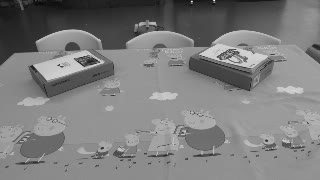 |
| 4    | Easy        | Medium\-textured desktop                 | uniform & stable      | circle \(slow\+normal\)             | default                | [iPhone 7, Huawei P20](https://beidou-sh.oss-cn-shanghai.aliyuncs.com/near_dataset/004.zip)   | 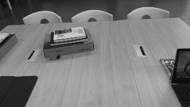 |
| 5    | Easy        | Medium\-textured desktop                 | uniform & stable      | hybrid                              | default                | [iPhone 7, Huawei P20](https://beidou-sh.oss-cn-shanghai.aliyuncs.com/near_dataset/005.zip)   | 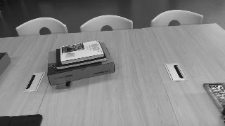 |
| 6    | Easy        | Medium\-textured desktop with reflection | uniform & stable      | circle \(slow\+normal\)             | default                | [iPhone 7, Huawei P20](https://beidou-sh.oss-cn-shanghai.aliyuncs.com/near_dataset/006.zip)   | 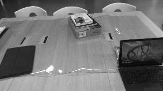|
| 7    | Easy        | Medium\-textured desktop with reflection | uniform & stable      | hybrid                              | default                | [iPhone 7, Huawei P20](https://beidou-sh.oss-cn-shanghai.aliyuncs.com/near_dataset/007.zip)   | 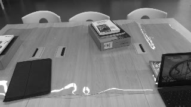 |
| 8    | Easy        | Rich\-textured livingroom                | uniform & stable      | translation \(slow\+normal\)        | default                | [iPhone 7, Huawei P20](https://beidou-sh.oss-cn-shanghai.aliyuncs.com/near_dataset/008.zip)   | 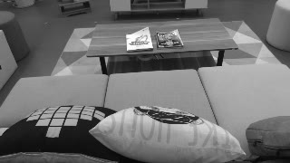 |
| 9    | Easy        | Rich\-textured livingroom                | uniform & stable      | circle \(slow\+normal\)             | default                | [iPhone XR, OnePlus 5T](https://beidou-sh.oss-cn-shanghai.aliyuncs.com/near_dataset/009.zip)  | 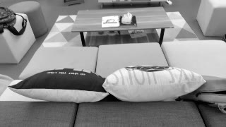 |
| 9_control    | Easy        | Rich\-textured livingroom                | uniform & stable      | circle \(slow\+normal\)             | default                | [iPhone XR, OnePlus 5T, MYNT](https://beidou-sh.oss-cn-shanghai.aliyuncs.com/near_dataset/009_control.zip)  | 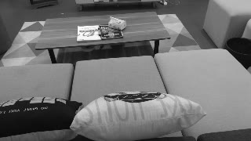 |
| 10   | Easy        | Rich\-textured livingroom                | uniform & stable      | hybrid                              | default                | [iPhone XR, OnePlus 5T](https://beidou-sh.oss-cn-shanghai.aliyuncs.com/near_dataset/010.zip)  | 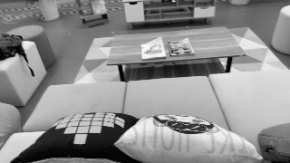 |
| 10_control   | Easy        | Rich\-textured livingroom                | uniform & stable      | hybrid                              | default                | [iPhone XR, OnePlus 5T, MYNT](https://beidou-sh.oss-cn-shanghai.aliyuncs.com/near_dataset/010_control.zip)  | 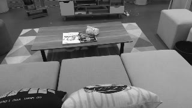 |
| 11   | Easy        | Rich\-textured livingroom                | uniform & stable      | user scan simulation                | default                | [iPhone XR, OnePlus 5T](https://beidou-sh.oss-cn-shanghai.aliyuncs.com/near_dataset/011.zip)  |  |
| 11_control   | Easy        | Rich\-textured livingroom                | uniform & stable      | user scan simulation                | default                | [iPhone XR, OnePlus 5T, MYNT](https://beidou-sh.oss-cn-shanghai.aliyuncs.com/near_dataset/011_control.zip)  |  |
| 12   | Normal\[2\] | Rich\-textured desktop                   | uniform & stable      | circle \(slow\+normal\+fast\)       | default                | [iPhone XR, OnePlus 5T](https://beidou-sh.oss-cn-shanghai.aliyuncs.com/near_dataset/012.zip)  | 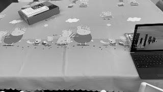 |
| 13   | Normal      | Rich\-textured desktop                   | uniform & stable      | hybrid                              | default                | [iPhone XR, OnePlus 5T](https://beidou-sh.oss-cn-shanghai.aliyuncs.com/near_dataset/013.zip)  |  |
| 14   | Normal      | Rich\-textured desktop                   | uniform & stable      | free                                | default                | [iPhone XR, OnePlus 5T](https://beidou-sh.oss-cn-shanghai.aliyuncs.com/near_dataset/014.zip)  | 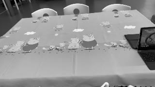 |
| 15   | Normal      | Rich\-textured desktop                   | uniform & stable      | game simulation \(YuMe\)            | default                | [iPhone XR, OnePlus 5T](https://beidou-sh.oss-cn-shanghai.aliyuncs.com/near_dataset/015.zip)  |  |
| 16   | Normal      | Medium\-textured desktop                 | uniform & stable      | circle \(slow\+normal\+fast\)       | default                | [iPhone XR, OnePlus 5T](https://beidou-sh.oss-cn-shanghai.aliyuncs.com/near_dataset/016.zip)  | 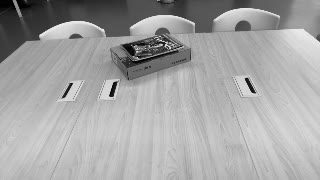 |
| 17   | Normal      | Medium\-textured desktop                 | uniform & stable      | hybrid                              | default                | [iPhone XR, OnePlus 5T](https://beidou-sh.oss-cn-shanghai.aliyuncs.com/near_dataset/017.zip)  | 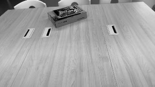 |
| 18   | Normal      | Medium\-textured desktop                 | uniform & stable      | free                                | default                | [iPhone XR, OnePlus 5T](https://beidou-sh.oss-cn-shanghai.aliyuncs.com/near_dataset/018.zip)  | 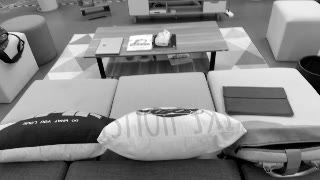 |
| 19   | Normal      | Medium\-textured desktop                 | uniform & stable      | game simulation \(YuMe\)            | default                | [iPhone XR, OnePlus 5T](https://beidou-sh.oss-cn-shanghai.aliyuncs.com/near_dataset/019.zip)  |  |
| 20   | Normal      | Medium\-textured desktop                 | dynamic               | circle \(slow\+normal\+fast\)       | default                | [iPhone XR, OnePlus 5T](https://beidou-sh.oss-cn-shanghai.aliyuncs.com/near_dataset/020.zip)  | 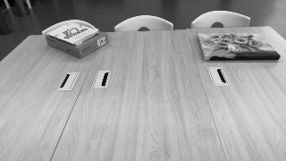 |
| 21   | Normal      | Medium\-textured desktop                 | dynamic               | hybrid                              | default                | [iPhone 7, Huawei P20](https://beidou-sh.oss-cn-shanghai.aliyuncs.com/near_dataset/021.zip)   | 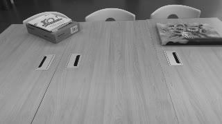 |
| 22   | Normal      | Medium\-textured desktop                 | dynamic               | free                                | default                | [iPhone 7, Huawei P20](https://beidou-sh.oss-cn-shanghai.aliyuncs.com/near_dataset/022.zip)   | 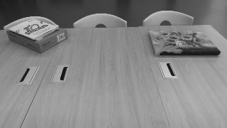 |
| 23   | Normal      | Medium\-textured desktop with reflection | uniform & stable      | circle \(slow\+normal\+fast\)       | default                | [iPhone 7, Huawei P20](https://beidou-sh.oss-cn-shanghai.aliyuncs.com/near_dataset/023.zip)   | 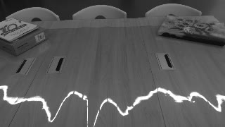 |
| 24   | Normal      | Medium\-textured desktop with reflection | uniform & stable      | hybrid                              | default                | [iPhone 7, Huawei P20](https://beidou-sh.oss-cn-shanghai.aliyuncs.com/near_dataset/024.zip)   | 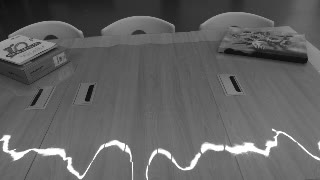 |
| 25   | Normal      | Medium\-textured desktop with reflection | uniform & stable      | free                                | default                | [iPhone 7, Huawei P20](https://beidou-sh.oss-cn-shanghai.aliyuncs.com/near_dataset/025.zip)   | 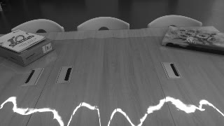 |
| 26   | Normal      | Median\-textured livingroom              | uniform & stable      | translation \(slow\+normal\+fast\)  | default                | [iPhone 7, Huawei P20](https://beidou-sh.oss-cn-shanghai.aliyuncs.com/near_dataset/026.zip)   | 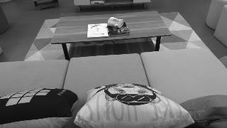 |
| 27   | Normal      | Median\-textured livingroom              | uniform & stable      | translation \(slow\+normal\+fast\)  | 30fps                  | [iPhone 7, Huawei P20](https://beidou-sh.oss-cn-shanghai.aliyuncs.com/near_dataset/027.zip)   | 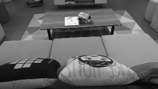 |
| 28   | Normal      | Median\-textured livingroom              | uniform & stable      | translation \(slow\+normal\+fast\)  | autofocus              | [iPhone 7, Huawei P20](https://beidou-sh.oss-cn-shanghai.aliyuncs.com/near_dataset/028.zip)   |  |
| 29   | Normal      | Median\-textured livingroom              | uniform & stable      | circle \(slow\)                     | default                | [iPhone XR, OnePlus 5T](https://beidou-sh.oss-cn-shanghai.aliyuncs.com/near_dataset/029.zip)  | 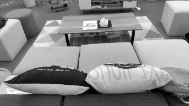 |
| 30   | Normal      | Median\-textured livingroom              | uniform & stable      | circle \(normal\)                   | default                | [iPhone XR, OnePlus 5T](https://beidou-sh.oss-cn-shanghai.aliyuncs.com/near_dataset/030.zip)  | 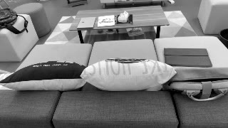 |
| 31   | Normal      | Median\-textured livingroom              | uniform & stable      | circle \(fast\)                     | default                | [iPhone XR, OnePlus 5T](https://beidou-sh.oss-cn-shanghai.aliyuncs.com/near_dataset/031.zip)  | 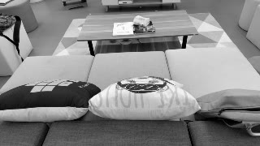 |
| 32   | Normal      | Median\-textured livingroom              | uniform & stable      | circle \(normal\)                   | 30fps                  | [iPhone XR, OnePlus 5T](https://beidou-sh.oss-cn-shanghai.aliyuncs.com/near_dataset/032.zip)  | 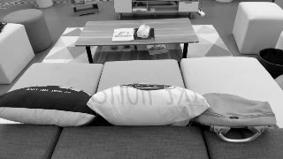 |
| 33   | Normal      | Median\-textured livingroom              | uniform & stable      | circle \(normal\)                   | autofocus              | [iPhone XR, OnePlus 5T](https://beidou-sh.oss-cn-shanghai.aliyuncs.com/near_dataset/033.zip)  | 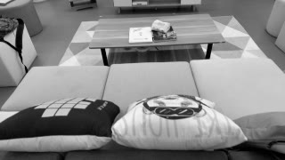 |
| 34   | Normal      | Median\-textured livingroom              | uniform & stable      | hybrid                              | default                | [iPhone XR, OnePlus 5T](https://beidou-sh.oss-cn-shanghai.aliyuncs.com/near_dataset/034.zip)  |  |
| 35   | Normal      | Median\-textured livingroom              | uniform & stable      | hybrid                              | 30fps                  | [iPhone XR, OnePlus 5T](https://beidou-sh.oss-cn-shanghai.aliyuncs.com/near_dataset/035.zip)  | 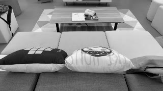 |
| 36   | Normal      | Median\-textured livingroom              | uniform & stable      | hybrid                              | autofocus              | [iPhone XR, OnePlus 5T](https://beidou-sh.oss-cn-shanghai.aliyuncs.com/near_dataset/036.zip)  | 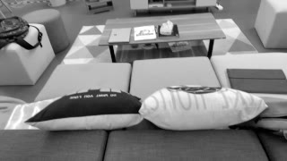 |
| 37   | Normal      | Median\-textured livingroom              | uniform & stable      | free                                | default                | [iPhone XR, OnePlus 5T](https://beidou-sh.oss-cn-shanghai.aliyuncs.com/near_dataset/037.zip)  |  |
| 38   | Normal      | Median\-textured livingroom              | uniform & stable      | user scan simulation                | default                | [iPhone XR, OnePlus 5T](https://beidou-sh.oss-cn-shanghai.aliyuncs.com/near_dataset/038.zip)  | 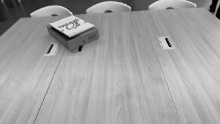 |
| 39   | Normal      | Median\-textured livingroom              | uniform & stable      | game simulation \(Shot\)            | default                | [iPhone 7, Huawei P20](https://beidou-sh.oss-cn-shanghai.aliyuncs.com/near_dataset/039.zip)   | 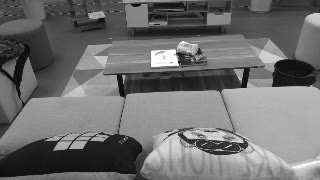 |
| 40   | Normal      | textureless floor and furnitures         | uniform & stable      | translation \(slow\+normal\+fast\)  | default                | [iPhone 7, Huawei P20](https://beidou-sh.oss-cn-shanghai.aliyuncs.com/near_dataset/040.zip)   | 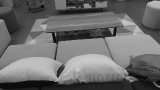 |
| 41   | Normal      | textureless floor and furnitures         | uniform & stable      | circle \(slow\)                     | default                | [iPhone 7, Huawei P20](https://beidou-sh.oss-cn-shanghai.aliyuncs.com/near_dataset/041.zip)   | 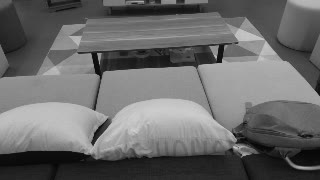 |
| 42   | Normal      | textureless floor and furnitures         | uniform & stable      | circle \(normal\)                   | default                | [iPhone 7, Huawei P20](https://beidou-sh.oss-cn-shanghai.aliyuncs.com/near_dataset/042.zip)   | 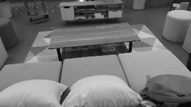 |
| 43   | Normal      | textureless floor and furnitures         | uniform & stable      | circle \(fast\)                     | default                | [iPhone 7, Huawei P20](https://beidou-sh.oss-cn-shanghai.aliyuncs.com/near_dataset/043.zip)   | 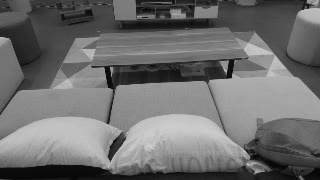 |
| 44   | Normal      | textureless floor and furnitures         | uniform & stable      | hybrid                              | default                | [iPhone 7, Huawei P20](https://beidou-sh.oss-cn-shanghai.aliyuncs.com/near_dataset/044.zip)   | 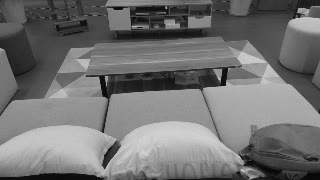 |
| 45   | Normal      | textureless floor and furnitures         | uniform & stable      | free                                | default                | [iPhone 7, Huawei P20](https://beidou-sh.oss-cn-shanghai.aliyuncs.com/near_dataset/045.zip)   | 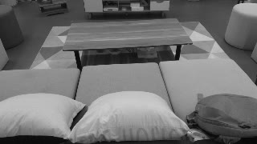 |
| 46   | Hard\[3\]   | Rich\-textured desktop                   | non\-uniform & stable | hybrid                              | default                | [iPhone 7, Huawei P20](https://beidou-sh.oss-cn-shanghai.aliyuncs.com/near_dataset/046.zip)   | 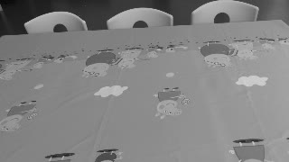 |
| 48   | Hard        | Medium\-textured desktop                 | non\-uniform & stable | hybrid                              | default                | [iPhone 7, Huawei P20](https://beidou-sh.oss-cn-shanghai.aliyuncs.com/near_dataset/048.zip)   | 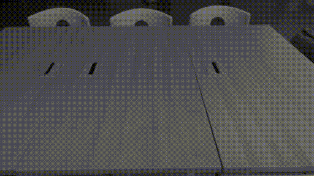 |
| 50   | Hard        | Medium\-textured desktop with reflection | non\-uniform & stable | hybrid                              | default                | [iPhone 7, Huawei P20](https://beidou-sh.oss-cn-shanghai.aliyuncs.com/near_dataset/050.zip)   | 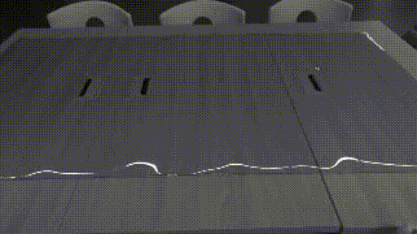 |
| 52   | Hard        | textureless floor and furnitures         | non\-uniform & stable | hybrid                              | default                | [iPhone 7, Huawei P20](https://beidou-sh.oss-cn-shanghai.aliyuncs.com/near_dataset/052.zip)   | 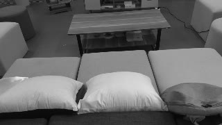 |

notes: 
1. "Easy" means  no repetitive texture, no reflection, no opened windows. Rich-textured carpets, sofas and walls.
2. "Normal" means a common livingroom settings. Median-textured carpets, sofas and walls. Some opened windows and a mirror.
3. "Hard" means Opened windows, mirrors, textureless floor, textureless furnitures, textureless walls, lamps.
4. "_control" means we have an additinal MYNT camera attached to record data besides of the two mobile phones.

## Dataset structure

The sequences are organized following the structure of widely used EuRoC:

```
./Case ID
│
└───ip7                                         A folder with phone name.
     └───P_lp2lv.txt                            The extrinsic between phone camera and rigid body.
     └───rts_compensate_extrinsic_and_time.txt  The ground truth trajectory (TUM format) of camera frame.
     └───timeoffset.txt                         Timestamp offset between phone camera and RTS system.
     │
     └───mav0
          │
          └───cam0
          │    └───data                         The folder contains image sequence.
          │    └───cam.yaml                     Camera settings when record this sequence.
          │    └───data.csv                     Timestamps of camera frames.
          │    └───sensor.csv                   Camera intrinsics and camera-IMU extrinsic.
          └───imu0
                └───data.csv                    Timestamps and IMU measurements.
                └───sensor.yaml                 IMU intrinsics and IMU-rig extrinsic which is identity.
```
​						

## Preview video

Considering the limited storage space, we made the preview videos in very low resolution and we speed them up. We post all the preview videos [NEAR-dataset-preview-video](https://www.youtube.com/channel/UCD89MMVLJYi9ZqWKdwmGpaQ/playlists?view_as=subscriber).
